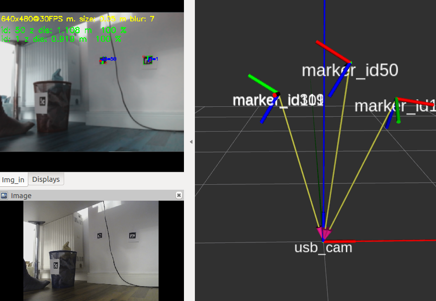

# aruco_detector_osv

## Overview

The aruco_detector_osv (aruco_detector_opencv) uses the ```#include <opencv2/aruco.hpp>```  library instead of using ```#include <aruco/aruco.h>``` (ros-kinetic-aruco). This package was tested on ubuntu 16.04, ROS Kinetic with a Logitech C920 camera. 

With this package you are able to:

* detect position and orientation of an [aruco marker](http://chev.me/arucogen/) relatively to the camera. The corresponding **tf** is published.
* a certainty parameter of how robust the arcuco marker is detected. 
* a result image with the detected markers highlighted is published.

**Author: Markus Lamprecht<br />
Maintainer: Markus Lamprecht, 2f4yor@gmail.com<br />**

Video:

<a alt="aruco_detector_example" href="https://www.youtube.com/watch?v=U0ul4WIQFUM"></a>

## Installation

### Dependencies

This software is built on the Robotic Operating System ([ROS]), which needs to be [installed](http://wiki.ros.org) first. Additionally, this package depends on following software:

- [alfons_msgs]
- [cv_bridge]
- [opencv]
- [tf2_ros]

### Building

In order to install this package, clone the latest version from this repository into your catkin workspace and compile the package using [catkin_tools](https://catkin-tools.readthedocs.io/en/latest/)

``` 
cd ~/Desktop
source /opt/ros/kinetic/setup.bash
mkdir -p catkin_ws/src
cd catkin_ws/src/
git clone git@github.com:CesMak/aruco_detector_ocv.git (takes some time due to included bag to test this package)
cd ..
catkin init -w .
catkin build
source devel/setup.bash
roscd roscd aruco_detector_ocv/data/
rosbag decompress 640x480_logitech_aruco3_compressed.orig.bag 
roslaunch aruco_detector_ocv detector.launch 
```

## Basic Usage

Please calibrate your camera first using: [camera_calibration](http://wiki.ros.org/camera_calibration).

See all adjustments in the **aruco_detector_osv/launch/detector.launch**

There are many opencv parameters that can be adjusted internally to reduce the effect of lightening conditions.
See [opencv_tutorial](https://docs.opencv.org/3.1.0/d5/dae/tutorial_aruco_detection.html)

In order to adjust camera options use **scripts/marker_filter.py**

## Main Launch file

``` 
roslaunch aruco_detector_ocv detector.launch 
``` 

## License BSD
If you want to use this package please contact: [me](https://simact.de/about_me).

## Bugs 

If you get (when using the camera)

``` 
[ERROR] [1551630633.628039127]: Cannot identify '/dev/video0': 2, No such file or directory
```

do 

``` 
sudo modprobe uvcvideo
``` 

## TODO's

- Reduce effect of motion blure if the camera is turned


[ROS]: http://www.ros.org
[rviz]: http://wiki.ros.org/rviz
[grid_map_msg/GridMap]: https://github.com/anybotics/grid_map/blob/master/grid_map_msg/msg/GridMap.msg
[sensor_msgs/PointCloud2]: http://docs.ros.org/api/sensor_msgs/html/msg/PointCloud2.html
[geometry_msgs/PoseWithCovarianceStamped]: http://docs.ros.org/api/geometry_msgs/html/msg/PoseWithCovarianceStamped.html
[tf/tfMessage]: http://docs.ros.org/kinetic/api/tf/html/msg/tfMessage.html
[std_srvs/Empty]: http://docs.ros.org/api/std_srvs/html/srv/Empty.html
[grid_map_msg/GetGridMap]: https://github.com/anybotics/grid_map/blob/master/grid_map_msg/srv/GetGridMap.srv
[grid_map_msgs/ProcessFile]: https://github.com/ANYbotics/grid_map/blob/master/grid_map_msgs/srv/ProcessFile.srv